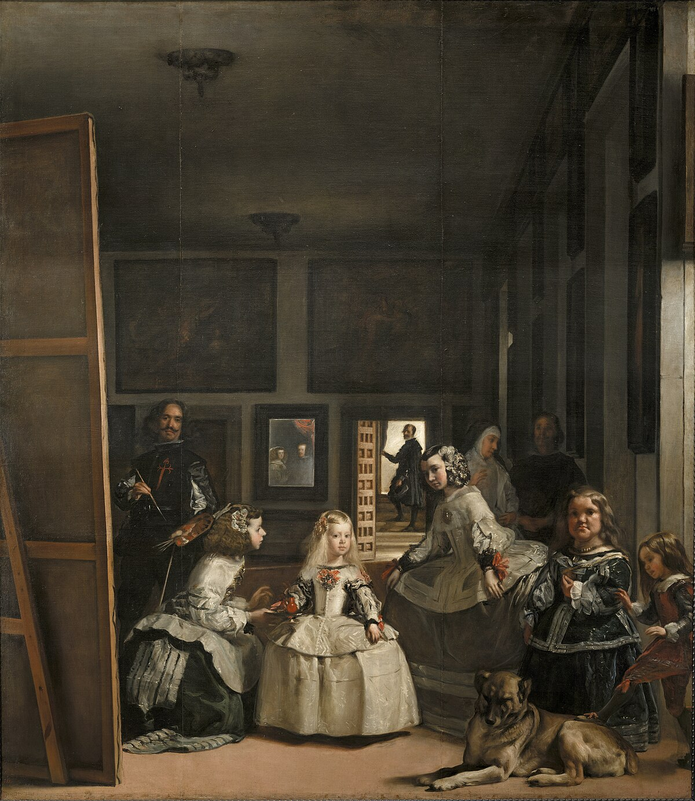
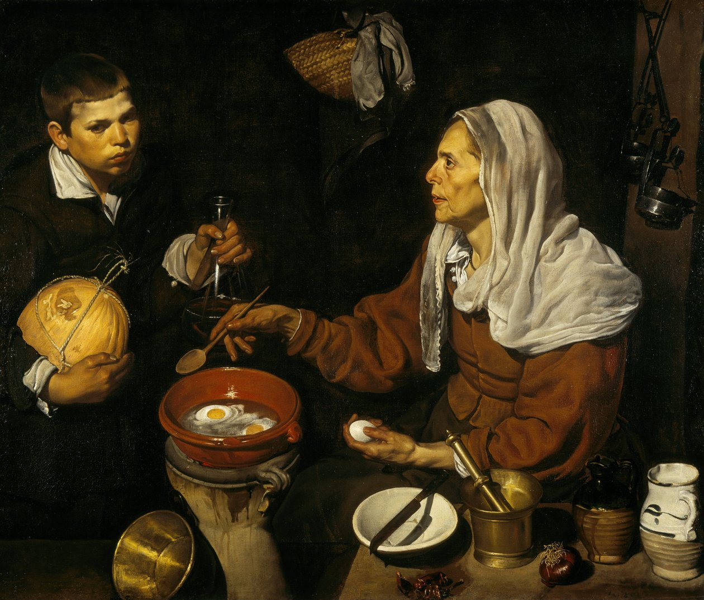
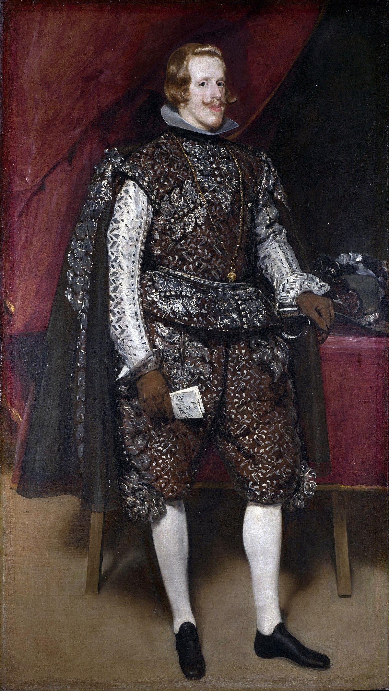
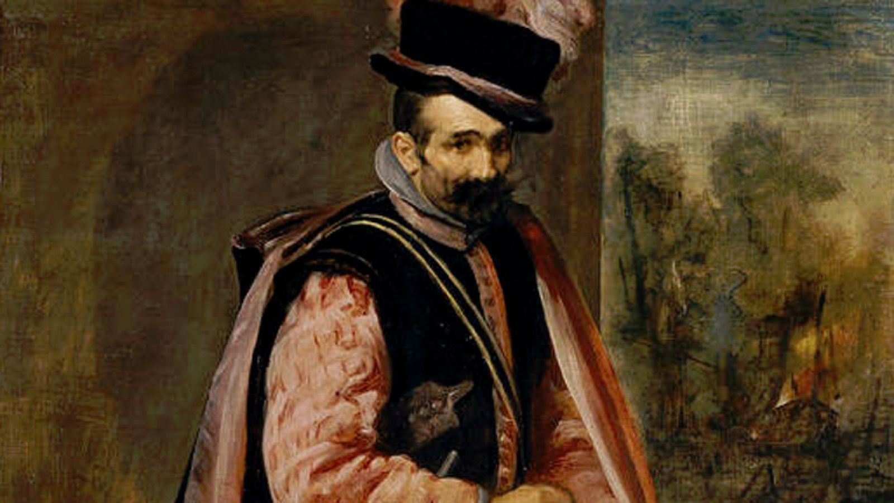
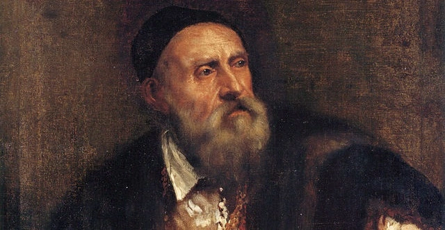
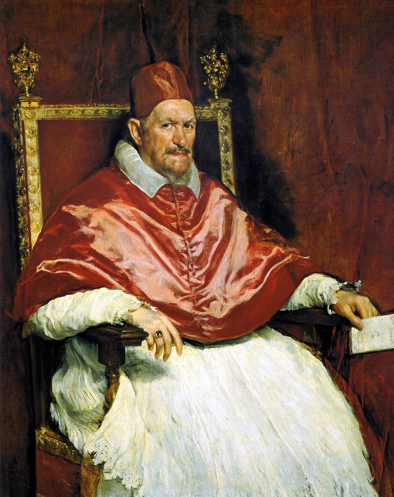
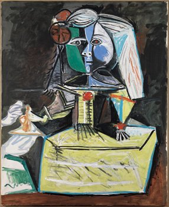

# 🎨 **Diego Velázquez: A Carreira de um Mestre do Barroco**

*Trabalho por: [Seu Nome]*  
*Disciplina: [Nome da Disciplina]*  
*Data: [Data]*  

---

## 🖋️ **Início e Formação**

- **Nascimento:** 1599, Sevilha, Espanha 🇪🇸
- **Início artístico:** Estudou arte aos **11 anos** com **Francisco Pacheco**  
- **Casamento:** Com **Juana Pacheco**, filha de seu mestre
- **Primeiras obras**: Retratavam cenas cotidianas com **realismo**:
  - *A Velha a Cozinhar Ovos* (1618)  

---

## 👑 **Ascensão na Corte**

- Mudou-se para **Madrid** em **1623**  
- Nomeado **pintor da corte** de **Filipe IV**
- **Destaques**: Retratou a **realeza**, **nobres**, **anões** e **bufões**, com grande dignidade
- Além de pintor, ocupou outros **importantes cargos na corte** de Filipe IV  

---

## 🎨 **Estilo e Temas**

- **Uso de luz e sombra** para criar **profundidade e volume**  
- Cores **vibrantes** e **atenção aos detalhes** para alcançar um estilo único  
- **Temas**: Retratos da corte, cenas **religiosas**, **mitológicas** e também do povo
- Obras destacadas:
  - *As Fiandeiras*
  - *O Bufão Don Juan de Áustria*  

---

## ✈️ **Viagens e Influências**

- Realizou viagens à **Itália** (1629 e 1649), onde **absorveu influências** de grandes mestres:
  - **Rafael** e **Ticiano**
- Estilo com forte mistura de **Renascimento** e **Barroco**

---

## 🌟 **Obras-Primas**

1. **As Meninas** (1656)  
   - Retrato icônico da **infanta Margarida**, da corte e do próprio Velázquez
2. **A Rendição de Breda** (1635)  
   - Simboliza a **dignidade** do vencido e a **honra** do conquistador
3. **Retrato do Papa Inocêncio X** (c. 1650)  
   - Um dos retratos mais **realistas** e **impactantes** da história

  

---

## 🏅 **Legado**

- **Cavaleiro da Ordem de Santiago** em **1659**
- Considerado um dos maiores pintores da história da arte ocidental  
- **Influência** duradoura sobre artistas como **Manet**, **Picasso** e **Dalí**
- Suas obras estão expostas em grandes museus, como:
  - **Museu do Prado** (Madrid)
  - **Metropolitan Museum of Art** (Nova York)

---

## 📚 **Fontes**

- [Britannica: Diego Velázquez](https://www.britannica.com/biography/Diego-Velazquez)
- [Biography.com: Diego Velázquez](https://www.biography.com/artists/diego-velazquez)
- [Museu do Prado](https://www.museodelprado.es/)
- [Wikipedia: Diego Velázquez](https://en.wikipedia.org/wiki/Diego_Vel%C3%A1zquez)
- [Galleria Doria Pamphilj](https://doriapamphilj.it/roma/)
